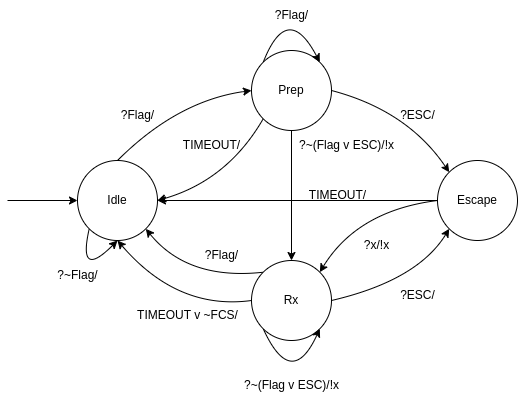
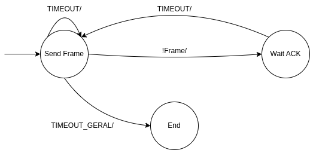

[](https://classroom.github.com/a/whdsA5h3)


# Protocolo PPP (Camada enlace)

## Responsáveis

<a href="https://github.com/lucascraupp">
    <br />
    <sub><b>Lucas Coelho Raupp</b></sub></a><br />

&nbsp;

<a href="https://github.com/jpmsb">
    <br />
    <sub><b>João Pedro Menegali Salvan Bitencourt</b></sub></a><br />

&nbsp;

## Receptor

### Máquina de estados



### Uso

Para utilizar o receptor, garanta que haja uma porta serial disponível e que esteja associada a uma outra porta serial, com a necessidade de ambas serem bidirecionais. Abaixo, está um comando de exemplo:

```bash
Protocolo/rx_enlace.py /dev/pts/3
```

O receptor ficará esperando até que toda a mensagem seja transmitida para então, imprimir na tela. O comprimento máximo da mensagem é de 1024 bytes, sendo o comprimento do quadro de 1029 bytes.

## Transmissor

### Máquina de estados



### Uso

Para utilizar o transmissor, os requisitos são os mesmos do receptor. Abaixo, está um comando de exemplo:

```bash
Protocolo/tx_enlace.py /dev/pts/4
```

Ao iniciar, será solicitada qual mensagem deverá ser enviada. O comprimento máximo da mensagem é de 1024 bytes. Mensagem de comprimentos maiores serão dividias em novos quadros até que todo fluxo seja enviado.

Uma mensagem pode ser enviada de forma programática utilizando o comando abaixo:

```bash
echo "Mensagem" | Protocolo/tx_enlace.py /dev/pts/4
```

Neste exemplo, a mensagem é lida até a próxima quebra de linha ocorrer. Para testar com uma mensagem que supere 1024 bytes de comprimento utilize o comando abaixo:

```bash
cat arquivo_teste | Protocolo/tx_enlace.py /dev/pts/4
```