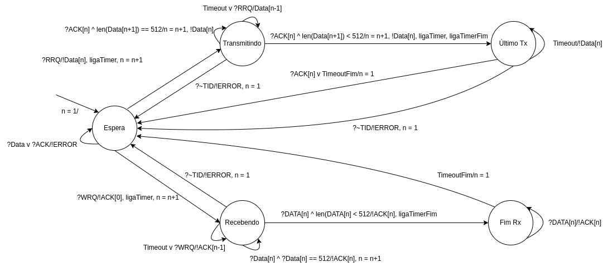
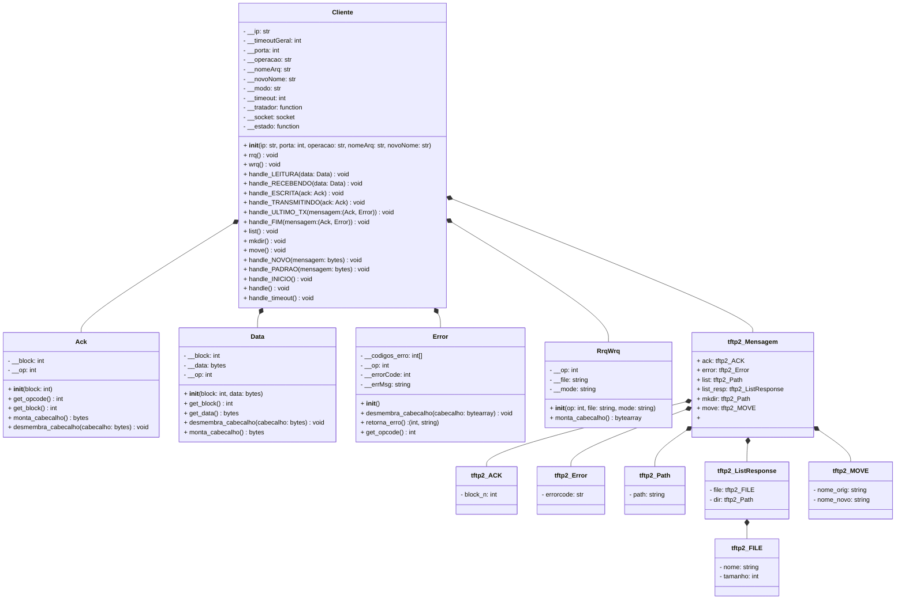
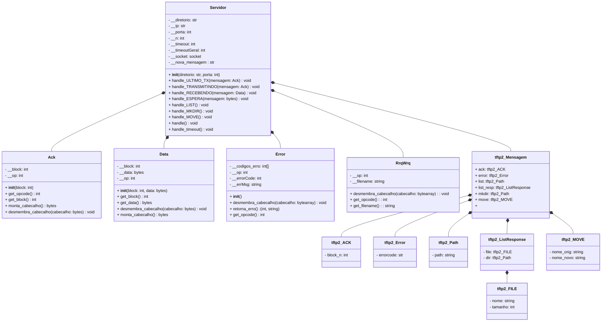

# Projeto de Protocolos

## Membros

<a href="https://github.com/andreyadriano">
     
    <b>Andrey Adriano da Rosa</b></a> 

&nbsp;

<a href="https://github.com/faustocristiano">
     
    <b>Fausto Cristiano</b></a> 

&nbsp;

<a href="https://github.com/lucascraupp">
     
    <b>Lucas Coelho Raupp</b></a> 

&nbsp;

Esse repositório contém a implementação de um protocolo real da disciplina Projeto de Protocolos (PTC029008).

## Especificação do protocolo TFTP2

### Serviço

O TFTP é um protocolo simples para transferência de arquivos, entre hosts em diferentes redes. Ele possui o serviço de leitura e gravação de arquivos de/para um servidor remoto. A versão 2 do protocolo permite a listagem de diretórios e arquivos do servidor, além da criação de diretórios e renomeação/remoção de arquivos.

### Vocabulário e Regras de Procedimento

#### RRQ: Read Request

Formato do pacote (é o mesmo para o WRQ):

    2 bytes | string   | 1 byte | string | 1 byte
    Opcode  | Filename |    0   |  Mode  |   0

O cliente envia uma solicitação de leitura de arquivo para o servidor. O servidor responde com um pacote de dados contendo o arquivo solicitado.

#### WRQ: Write Request

O cliente envia uma solicitação de escrita de arquivo para o servidor. O servidor responde com um ACK para que o cliente inicie a transferência do arquivo.

#### DATA: Dados

Formato do pacote:

    2 bytes | 2 bytes  | n bytes
    Opcode  | Block #  |  Data

É o pacote de dados transferido entre o cliente e o servidor nas operações de leitura e escrita. O pacote deve conter no máximo 512 bytes de dados. Caso o arquivo exceda este tamanho, múltiplos pacotes devem ser enviados até que a transferência se complete.

#### ACK: Acknowledgement

Formato do pacote:

    2 bytes | 2 bytes
    Opcode  | Block #

O pacote de ACK é enviado confirmando a recepção de uma mensagem. O campo Block # deve conter o número do bloco recebido.

#### ERROR: Erro

Formato do pacote:

    2 bytes |  2 bytes  | string | 1 byte   
    Opcode  | ErrorCode | ErrMsg |   0  

O pacote de erro é enviado pelo servidor quando ocorre algum erro durante alguma operação. O campo ErrorCode deve conter o código do erro e ErrMsg deve conter uma mensagem de erro.

#### LIST: Listar diretórios e arquivos

O cliente solicita ao servidor a listagem de diretórios e arquivos em um determinado diretório. O servidor responde com um pacote de dados contendo a listagem no seguinte formato:

    list_resp {
        items {
            file {
                nome: "nomeArquivo"
                tamanho: 1234
            }
        }
        items {
            dir {
                path: "nomeDiretorio"
            }
        }
    }

#### MKDIR: Criar diretórios

O cliente solicita ao servidor que crie um diretório no caminho especificado. O servidor verifica se o diretório já existe. Se não exisir, ele cria. Se existir, ele retorna um erro.

#### MOVE: Renomear/Remover arquivo

O cliente pode escolher renomear ou remover o arquivo. Se o cliente enviar dois nomes, o arquivo será renomeado, se enviar apenas um, o arquivo será apagado. O servidor verifica e retorna um erro se o arquivo original existe ou se já existe um arquivo com o novo nome.

## Máquina de Estados (TFTP 1)

### Cliente

### Servidor

## Diagrama de Classes (TFTP 2)

### Cliente

### Servidor

## Como executar

### Servidor

Para executar o servidor, entre na pasta `Servidor` e execute o comando:

    python3 servidor.py <caminhoAbsoluto> <Porta>
    Exemplo: python3 servidor.py /home/aluno/tftp/Servidor 6969

### Cliente

Para executar o cliente, entre na pasta `Cliente` e execute o comando de acordo com a operação desejada:

#### Solicitação de arquivo do servidor (RRQ):

    python3 cliente.py <IP> <Porta> rrq <nomeArquivo>
    Exemplo: python3 cliente.py 127.0.0.1 6969 rrq Lusíadas.pdf

#### Solicitação de transferência de arquivo pro servidor (WRQ):

    python3 cliente.py <IP> <Porta> wrq <nomeArquivo>
    Exemplo: python3 cliente.py 127.0.0.1 6969 wrq teste.txt

#### Listar diretórios e arquivos (LIST)

    python3 cliente.py <IP> <Porta> list <caminho>
    Exemplo: python3 cliente.py 127.0.0.1 6969 list ./

#### Criar diretórios (MKDIR)

    python3 cliente.py <IP> <Porta> mkdir <nomeDiretorio>
    Exemplo: python3 cliente.py 127.0.0.1 6969 mkdir teste

É possível criar diretórios aninhados, basta passar o caminho absoluto do diretório desejado (exemplo "teste1/teste2/teste3")

#### Renomear/Remover arquivo (MOVE)

Renomear arquivo:

    python3 cliente.py <IP> <Porta> move <nomeArquivo> <novoNomeArquivo>
    Exemplo: cliente.py 127.0.0.1 6969 move teste.txt teste2.txt

Remover arquivo:
    
    python3 cliente.py <IP> <Porta> move <nomeArquivo>
    Exemplo: cliente.py 127.0.0.1 6969 move teste.txt
